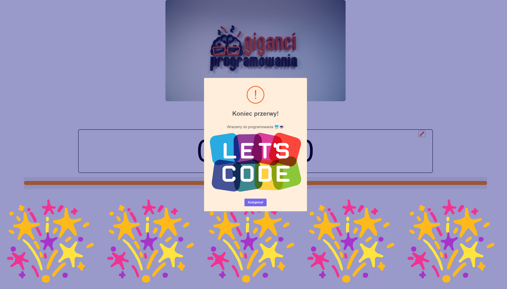

### README

# Educational Project - Timer

## Project Description

The project was created during the peak of ChatGPT's popularity, in order to check how the model copes with programming I asked him to create this project, the code was 95% generated by AI and only required occasional small corrections.

This is a project created specifically for my on-site classes for students at Programming Giants. This mini project was designed for short breaks during intense programming sessions to provide a moment of relaxation and motivation. It streamlines the break process and makes it even more enjoyable, especially when students can choose a different ringtone for each session.

## Features

- **Personalized Timer**: Customize break time to your needs. Start, stop, and change the time as needed.

- **Filling Progress Bar**: A visually pleasing progress bar that shows the remaining break time.

- **Large Clock**: A convenient large clock to easily check how much time is left before returning to programming.

- **Graphics and Sound after the Break**: After the break time is over, a random programming-related graphic will appear, along with the previously chosen "class bell" selected by the students.

## How to Run

1. Clone the repository to your local computer:

```bash
git clone https://github.com/MateuszKurowski/giganci-minutnik.git
```

2. Open the `index.html` file in your browser.

3. Customize the page according to your preferences, add new graphics, change sounds, and adjust break time.

## Customization

Graphics for the end-of-break message are randomly chosen from the 'img' folder. Add new graphics there and enter their names in the array in the code (src/script.js:147).

The bell indicating the end of the break is an .mp3 sound named 'bell.mp3'. For the bell to work, it must be named exactly like that and be located in the same folder as the 'index.html' file. In the 'sound' folder, I have added a few sample bells/samples.

## License

This project is available under the MIT License - check the [LICENSE](LICENSE) file for details.

## Screenshots


Time editing:

End of break message:

