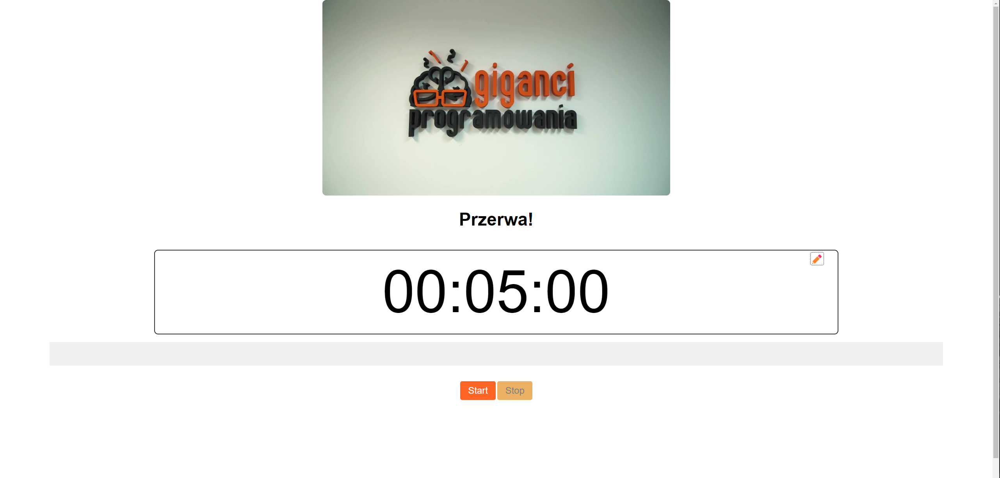
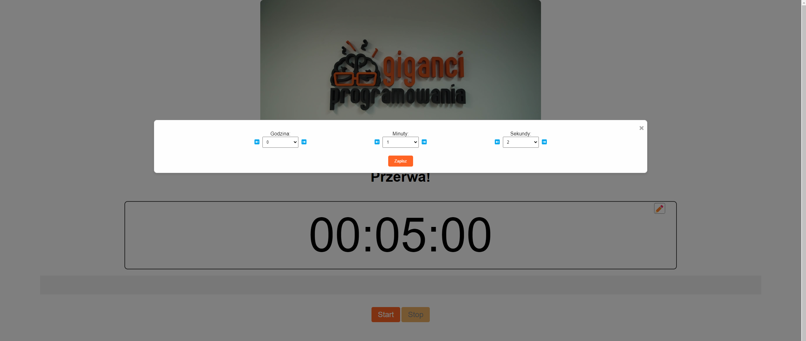
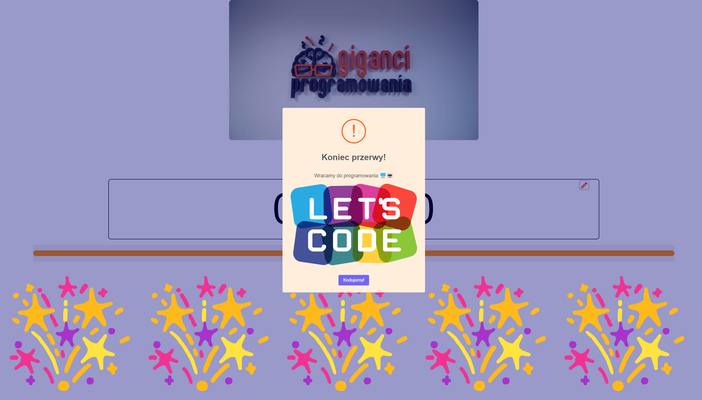

# Projekt edukacyjny - Minutnik

## Opis Projektu

Projekt powstał w okresie szczytu popularności ChatGPT, w celu sprawdzenia jak radzi sobie model z programowaniem poprosiłem go o stworzenie tego projektu, kod został w 95% wygenerowany przez AI i wymagał tylko czasami małych poprawek.

Jest to projekt utworzony specjalnie na moje zajecia stacjonarne dla uczniów w Gigantach Programowania. Ten mini projekt powstał z myślą o krótkich przerwach podczas intensywnych zajęć programowania, aby dostarczyć chwilę rozluźnienia i motywacji. Usprawnia proces przerwy i czyni go jeszcze przyjemniejszym. Zwłaszcza gdy uczniowie mogą wybrać dźwięk dzwonka inny na każde zajęcia.

## Funkcje

- **Spersonalizowany Minutnik**: Dostosuj czas przerwy do swoich potrzeb. Rozpocznij, zatrzymaj i zmień czas w zależności od aktualnej potrzeby.

- **Napełniający się Progress Bar**: Przyjemny dla oka pasek postępu, który wizualnie prezentuje pozostały czas przerwy.

- **Duży Zegar**: Wygodny duży zegar, aby uczestnicy z łatwością mogli sprawdzić, ile czasu pozostało do powrotu do programowania.

- **Grafika i Dźwięk po Przerwie**: Po zakończeniu czasu przerwy, pojawi się losowa grafika związana z programowaniem, a także wybrany wcześniej przez uczniów "dzwonek na zajęcia".

## Jak Uruchomić

1. Sklonuj repozytorium na swój lokalny komputer:

```bash
git clone https://github.com/MateuszKurowski/giganci-minutnik.git
```

2. Otwórz plik `index.html` w swojej przeglądarce.

3. Dostosuj stronę według własnych preferencji, dodaj nowe grafiki, zmień dźwięki i dostosuj czas przerwy.

## Personalizacja

Grafiki do losowania do komunikatu o końcu przerwy pobierane są z folderu img. Dodaj tam nowe grafiki oraz w kodzie wpisz ich nazwę do tablicy (src/script.js:147)

Dzwonek oznaczający koniec przerwy to dźwięk w formacie .mp3 nazywający się 'dzwonek.mp3'. Aby dzwonek zadziałał musi się dokładnie tak nazwyać i znajdować w folderze z plikiem 'index.html'. W folderze 'sound' dodałem pare przykładowych dzownków/sampli.

## Licencja

Ten projekt jest dostępny na licencji MIT - sprawdź plik [LICENSE](LICENSE) dla szczegółów.

## Zrzut Ekranu


Edycja czasu:

Komunikat o końcu przerwy:

